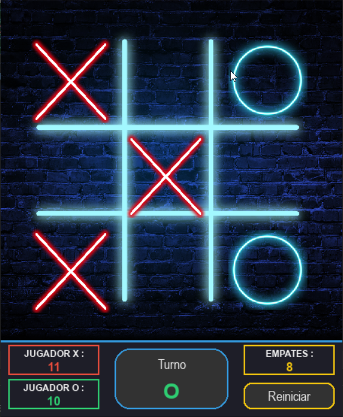

# 🎮 Game - Tic Tac Toe 

**Tic Tac Toe** (Tres en línea) es un mini-juego clásico hecho con **Python + Pygame**.  
Cuenta con interfaz gráfica, sonidos, y almacenamiento de puntajes. Desarrollo de videojuego 2D.

---

## 🖼️ Vista previa

---

## 🛠️ Tecnologías utilizadas

  
  
  

---

## ✨ Características

✔️ Interfaz visual limpia con íconos  
✔️ Sonidos al jugar, ganar o empatar  
✔️ Registro de puntajes en `scores.json`  
✔️ Compatible con Windows/Linux/Mac (requiere Python)  
✔️ Opción de compilar como `.exe`

---

## ⚙️ Instalación y ejecución

### 🔧 1. Clona el repositorio

`
git clone https://github.com/GV-JeanPool/pygame-tictactoe.git
cd pygame-tictactoe
`

---

### 🧪 2. Instala las dependencias

`
pip install pygame
`

---

### ▶️ 3. Ejecuta el juego

`
python tictactoe.py
`

---

### 📜 Licencia
Este proyecto está bajo la Licencia MIT.

---

### ✉️ Contacto

GV-JeanPool
🐱 GitHub Profile

